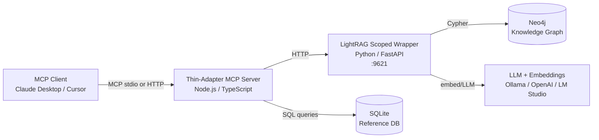

# Self-Hosting `shrine-diet-bioactivity`

End-to-end guide for running the knowledge graph, LightRAG semantic engine,
MCP server, and dataset ingestion pipeline on your own infrastructure.

> **Scope**: this guide assumes you want the *full* stack running locally or
> on a single server. For integrating just the MCP tool surface against an
> existing LightRAG deployment, skip to [Option B — MCP client only](#option-b--mcp-client-only).

---

## Contents

- [Architecture at a Glance](#architecture-at-a-glance)
- [Prerequisites](#prerequisites)
- [Option A — Full Self-Host](#option-a--full-self-host)
  - [1. Clone with submodules](#1-clone-with-submodules)
  - [2. Start Neo4j](#2-start-neo4j)
  - [3. Run an embedding + LLM provider](#3-run-an-embedding--llm-provider)
  - [4. Set up the LightRAG wrapper](#4-set-up-the-lightrag-wrapper)
  - [5. Download + build the base SQLite KG](#5-download--build-the-base-sqlite-kg)
  - [6. Ingest the OpenNutrition dataset](#6-ingest-the-opennutrition-dataset)
  - [7. Ingest external datasets (CMAUP, CTD, TTD)](#7-ingest-external-datasets-cmaup-ctd-ttd)
  - [8. Push the unified KG into LightRAG](#8-push-the-unified-kg-into-lightrag)
  - [9. Start the MCP server](#9-start-the-mcp-server)
  - [10. Connect an MCP client](#10-connect-an-mcp-client)
- [Option B — MCP client only](#option-b--mcp-client-only)
- [Environment Reference](#environment-reference)
- [Makefile Target Index](#makefile-target-index)
- [Data Source Licensing](#data-source-licensing)
- [Troubleshooting](#troubleshooting)

---

## Architecture at a Glance



| Component | Lives in | Runtime |
|---|---|---|
| Thin-adapter MCP server | `shrine-diet-bioactivity/` | Node.js 18+ |
| LightRAG scoped wrapper | `lightrag/` (git submodule) + `scripts/lightrag/` | Python 3.10+ |
| Unified SQLite KG | `shrine-diet-bioactivity/data/` | File-based |
| Neo4j graph DB | Docker container or managed (Aura, Railway) | Docker 20+ |
| Embeddings + LLM | Ollama / LM Studio / OpenAI-compatible API | varies |

---

## Prerequisites

| Tool | Version | Why |
|---|---|---|
| **Git** | 2.30+ | Submodule support |
| **Node.js** | 18+ | MCP server + TypeScript build |
| **npm** | 9+ | Dependency install |
| **Python** | 3.10+ | LightRAG ingestion scripts |
| **Docker** | 20+ | Neo4j container (or use managed Neo4j) |
| **Make** | any | Target runner (Makefile in repo) |
| **Ollama** *or* **OpenAI API key** *or* **LM Studio** | current | Embeddings + LLM for LightRAG |
| **Disk** | ≥ 10 GB free | Source CSVs (~1 GB) + Neo4j + SQLite + model caches |
| **RAM** | ≥ 16 GB | Neo4j + Ollama + build process |

Network:

- Access to `github.com` for clone + submodule fetch
- Access to the data-source hosts (USDA, NIH, internal mirrors — see
  [Data Source Licensing](#data-source-licensing))
- If using OpenAI / Jina / OpenRouter as the LLM provider, outbound access
  to their APIs

---

## Option A — Full Self-Host

### 1. Clone with submodules

```bash
git clone --recurse-submodules https://github.com/Syntropy-Health/shrine-diet-bioactivity.git
cd shrine-diet-bioactivity
```

If you already cloned without submodules:

```bash
git submodule update --init --recursive
```

Submodules pulled:

- `lightrag/` — LightRAG semantic KG framework (HKUDS)
- `mcp-opennutrition/` — OpenNutrition MCP server (deadletterq)

Install TypeScript dependencies:

```bash
cd shrine-diet-bioactivity
npm install
```

### 2. Start Neo4j

**Docker (recommended for local dev):**

```bash
docker run -d --name neo4j \
  -p 7474:7474 -p 7687:7687 \
  -e NEO4J_AUTH=neo4j/your-local-password \
  -e NEO4J_PLUGINS='["apoc"]' \
  -v neo4j_data:/data \
  neo4j:5
```

Verify: open http://localhost:7474 and sign in with `neo4j / your-local-password`.

**Managed Neo4j:**

- [Neo4j Aura](https://neo4j.com/aura/) — hosted, Cypher-compatible
- [Railway](https://railway.app/) template with Neo4j 5
- Any Neo4j 5+ instance reachable via Bolt

Set these environment variables (`~/.bashrc` or a project `.env`):

```bash
export NEO4J_URI=bolt://localhost:7687
export NEO4J_USER=neo4j
export NEO4J_PASSWORD=your-local-password
```

### 3. Run an embedding + LLM provider

LightRAG needs an embedding model (for vector search) and an LLM (for entity
extraction during semantic-search queries). Pick one stack:

**Option 3a — Ollama (all-local, recommended for laptops)**

```bash
# Install Ollama: https://ollama.com/download
ollama pull bge-m3           # embedding model (568M parameters, multilingual)
ollama pull qwen2.5:7b       # LLM for query-time extraction
ollama serve                  # runs on :11434
```

Env vars:

```bash
export LLM_BINDING_HOST=http://localhost:11434
export LLM_MODEL=qwen2.5:7b
export EMBEDDING_BINDING_HOST=http://localhost:11434
export EMBEDDING_MODEL=bge-m3
```

**Option 3b — OpenAI + Jina (production-grade, paid)**

```bash
export OPENAI_API_KEY=sk-...
export JINA_API_KEY=jina_...
# See lightrag/config_production.env for the full setting set
```

**Option 3c — LM Studio (GUI, OpenAI-compatible local server)**

Start LM Studio, load `bge-m3` and a general-purpose LLM (e.g., `qwen2.5-7b`),
enable the local server on port 1234. Env vars:

```bash
export EMBEDDING_BASE_URL=http://127.0.0.1:1234/v1
export LLM_BASE_URL=http://127.0.0.1:1234/v1
```

### 4. Set up the LightRAG wrapper

The LightRAG "scoped wrapper" adds per-tenant scope filtering on top of
upstream LightRAG.

```bash
cd shrine-diet-bioactivity
make lightrag-setup          # creates venv + installs deps
```

Verify env wiring (without starting the server):

```bash
make neo4j-check             # should show 0 nodes on a fresh DB
make embedding-check         # should return a 768-dim vector
```

### 5. Download + build the base SQLite KG

This pulls Dr. Duke's Phytochemical database + FooDB's compound-food pairs
and builds the unified SQLite.

```bash
# From shrine-diet-bioactivity/
make download                # ~960 MB; takes 2-5 min on good connection
make build                   # builds the SQLite KG
make migrate                 # KG expansion: symptoms, targets, food plants
```

Expected output: `shrine-diet-bioactivity/data/unified-diet.db` (~200 MB)
with roughly 2.4k herbs, 94k compounds, 4.1M compound-food pairs.

### 6. Ingest the OpenNutrition dataset

OpenNutrition (326k foods) lives in a git submodule and builds its own
SQLite DB. Then a "food bridge" script reconciles FooDB's ~1k foods with
OpenNutrition's 326k foods via a 5-strategy fuzzy match.

```bash
# Build the OpenNutrition SQLite (from the submodule's package scripts)
cd mcp-opennutrition
npm install
npm run build                # produces mcp-opennutrition/data/opennutrition.db
cd ..

# Build the food-name bridge
cd shrine-diet-bioactivity
make food-bridge             # produces food_bridge_mapping.json
make enrich-nutrition        # adds nutrition_100g to compound_foods rows
```

Expected result: `compound_foods` in the unified SQLite gains nutrition
macros for the matched food rows.

### 7. Ingest external datasets (CMAUP, CTD, TTD)

These extend the KG with molecular targets and disease associations.

```bash
make download-cmaup          # CMAUP v2.0: 758 targets, 429k compound-target links
make download-ttd            # TTD: 3.7k therapeutic targets
# CTD download is bundled with `make download`
make migrate-multi           # load CMAUP + CTD + TTD into the unified DB
```

> **Licensing note**: CMAUP, CTD, TTD are free for academic/research use
> but have attribution requirements for redistribution. See
> [Data Source Licensing](#data-source-licensing).

### 8. Push the unified KG into LightRAG

At this point the unified SQLite has the structured data. LightRAG layers
a semantic KG on top — entity embeddings + Neo4j storage.

```bash
make lightrag-dry-run        # preview: counts entities/relationships, no writes
make lightrag-ingest-local   # ingest into LightRAG using local (Ollama) embeddings
# OR
make lightrag-ingest-prod    # ingest using production API embeddings (OpenAI + Jina)
```

Expected result: Neo4j ends up with ~7,722 nodes and ~795 edges (baseline
ingestion — grows as you tune the subsample settings).

Verify:

```bash
make neo4j-stats             # node/edge breakdown by type
make lightrag-metrics        # data-quality report (entity name collisions, etc.)
```

### 9. Start the MCP server

Two servers to run:

**a) The LightRAG scoped wrapper (port 9621):**

```bash
# In one terminal
make lightrag-server         # tenant-scoped FastAPI wrapper
```

**b) The thin-adapter MCP server (stdio, launched by the MCP client):**

The thin-adapter doesn't need manual starting — the MCP client spawns it.
Just make sure the TypeScript is compiled:

```bash
make build-ts                # produces shrine-diet-bioactivity/build/
```

### 10. Connect an MCP client

**Claude Desktop** (`~/Library/Application Support/Claude/claude_desktop_config.json`
on macOS, `%APPDATA%\Claude\claude_desktop_config.json` on Windows):

```json
{
  "mcpServers": {
    "shrine-diet-bioactivity": {
      "command": "node",
      "args": [
        "/absolute/path/to/shrine-diet-bioactivity/shrine-diet-bioactivity/build/index.js"
      ],
      "env": {
        "LIGHTRAG_API_URL": "http://localhost:9621",
        "NEO4J_URI": "bolt://localhost:7687",
        "NEO4J_USER": "neo4j",
        "NEO4J_PASSWORD": "your-local-password"
      }
    }
  }
}
```

Restart Claude Desktop. In the conversation, ask:

> What compounds in turmeric have anti-inflammatory bioactivity?

If the tools fire, you should see tool calls like `search-herbs`,
`get-herb-compounds`, `search-by-bioactivity`, or `semantic-search` in the
response.

**Cursor / VS Code** — similar structure in the Cursor/Continue settings
file, or in `.mcp.json` at your project root.

---

## Option B — MCP client only

If someone else is hosting the LightRAG service and you just want to point
an MCP client at it:

1. Get the LightRAG URL + a bearer token / API key from the operator
2. Clone this repo and `npm install` inside `shrine-diet-bioactivity/`
3. Run `make build-ts`
4. Configure your MCP client with:
   ```json
   {
     "env": {
       "LIGHTRAG_API_URL": "https://kg.example.com",
       "LIGHTRAG_API_KEY": "your-token"
     }
   }
   ```
5. Skip all the Neo4j / ingestion steps

---

## Environment Reference

Copy [`.env.example`](./.env.example) to `.env` and fill in your values.

| Variable | Required | Default | Notes |
|---|---|---|---|
| `NEO4J_URI` | yes | `bolt://localhost:7687` | Bolt URL for Neo4j |
| `NEO4J_USER` | yes | `neo4j` | |
| `NEO4J_PASSWORD` | yes | — | Set strong value in prod |
| `LIGHTRAG_API_URL` | for client | `http://localhost:9621` | Where the LightRAG wrapper listens |
| `LIGHTRAG_API_KEY` | for client | — | Bearer token if wrapper is auth-enabled |
| `LLM_BINDING_HOST` | yes | `http://localhost:11434` | Ollama/OpenAI endpoint |
| `LLM_MODEL` | yes | `qwen2.5:7b` | LLM for entity extraction |
| `EMBEDDING_BINDING_HOST` | yes | `http://localhost:11434` | Embedding endpoint |
| `EMBEDDING_MODEL` | yes | `bge-m3` | 568M params, multilingual |
| `EMBEDDING_DIM` | yes | `768` | Must match the model |
| `BATCH_SIZE` | no | `100` | Ingestion tuning |
| `MAX_HERBS` | no | `100` | Subsample for small experiments |
| `MAX_COMPOUNDS` | no | `500` | Subsample for small experiments |

Never commit a `.env` file with real credentials — the repo's `.gitignore`
already excludes `.env` and `.env.*`.

---

## Makefile Target Index

Run `make help` for the authoritative live list. Key targets:

**Setup**
- `make setup` — full pipeline: download → build → migrate → bridge → enrich
- `make download` — Duke + FooDB (~960 MB)
- `make download-all` — Duke + FooDB + CMAUP + TTD
- `make lightrag-setup` — Python venv + deps

**Build & ingest**
- `make build` — unified SQLite DB
- `make migrate` — KG expansion
- `make migrate-multi` — CMAUP + CTD + TTD load
- `make food-bridge` — FooDB ↔ OpenNutrition name bridge
- `make enrich-nutrition` — nutrition data enrichment
- `make lightrag-dry-run` — preview ingestion
- `make lightrag-ingest-local` — ingest with Ollama embeddings
- `make lightrag-ingest-prod` — ingest with OpenAI + Jina

**Run**
- `make lightrag-server` — scoped FastAPI wrapper on :9621
- `make build-ts` — compile the thin-adapter MCP

**Verify**
- `make neo4j-check` — connection test
- `make neo4j-stats` — KG counts
- `make lightrag-metrics` — data quality report
- `make lightrag-benchmark` — 10 query suite
- `make embedding-check` — embedding endpoint test
- `make test` — vitest suite

**Maintenance**
- `make neo4j-clear` — ⚠️ wipe Neo4j
- `make audit-recent` — tail the per-tenant audit log
- `make clean` — remove build artifacts

---

## Data Source Licensing

| Dataset | License | Redistribution |
|---|---|---|
| USDA FoodData Central | Public Domain | Free |
| OpenNutrition | MIT | Attribution required |
| NIH DSLD | Public Domain | Free |
| Dr. Duke's Phytochemical DB | Public Domain (USDA ARS) | Free |
| FooDB | Non-commercial research use | Restricted — verify before redistribution |
| CMAUP v2.0 | Academic use | Restricted — verify before redistribution |
| CTD | Attribution required | Free w/ attribution |
| TTD | Academic use | Restricted — verify before redistribution |

If you plan to publish or redistribute the unified KG or a fine-tuned
artifact derived from it, verify compliance with the **most restrictive**
of the above licenses. See [LICENSE](./LICENSE) for full third-party
attribution.

---

## Troubleshooting

### `make neo4j-check` fails with "connection refused"

Neo4j isn't running, or `NEO4J_URI` is wrong. Verify:

```bash
docker ps | grep neo4j
curl http://localhost:7474
```

### LightRAG ingest throws "embedding dim mismatch"

`EMBEDDING_DIM` doesn't match the model's actual dimension. Common values:

- `bge-m3` → 1024
- `text-embedding-embeddinggemma-300m-qat` → 768
- `text-embedding-3-small` → 1536

Rebuild after correcting: `make lightrag-ingest-local` creates new embeddings.

### `make download` fails with "URL not found"

Data-source URLs occasionally change. Check `scripts/download-sources.ts`
for the current URLs; raise an issue if a source has moved.

### OpenNutrition build is slow

Initial build takes 5-10 min on a first run (326k-row SQLite generation).
Subsequent `npm run build` calls are incremental and fast.

### Thin-adapter MCP server doesn't appear in Claude Desktop

- Confirm the absolute path in `claude_desktop_config.json` exists
- Confirm `make build-ts` has run and `build/index.js` exists
- Check Claude Desktop's MCP logs
  (`~/Library/Logs/Claude/mcp.log` on macOS)
- The thin-adapter requires `LIGHTRAG_API_URL` to be reachable at startup

### Cross-tenant scope leak detected

This should not happen with the scoped wrapper on. If `make
lightrag-canary-test` reports a leak, open a security issue (see
[SECURITY.md](./SECURITY.md)). Do not proceed with multi-tenant deployment
until resolved.

---

## Going Further

- **Performance tuning**: batch size, embedding model selection, Neo4j
  memory config — see [`docs/kg-architecture-design.md`](./docs/kg-architecture-design.md)
- **Adding a new data source**: follow the checklist in [CONTRIBUTING.md](./CONTRIBUTING.md#data-source-contributions)
- **Production deployment**: Railway, Kubernetes, or bare-metal patterns —
  TBD; contribute a guide if you've done this

*Questions?* Open a [GitHub Discussion](https://github.com/Syntropy-Health/shrine-diet-bioactivity/discussions)
or see the Contributing section above.
